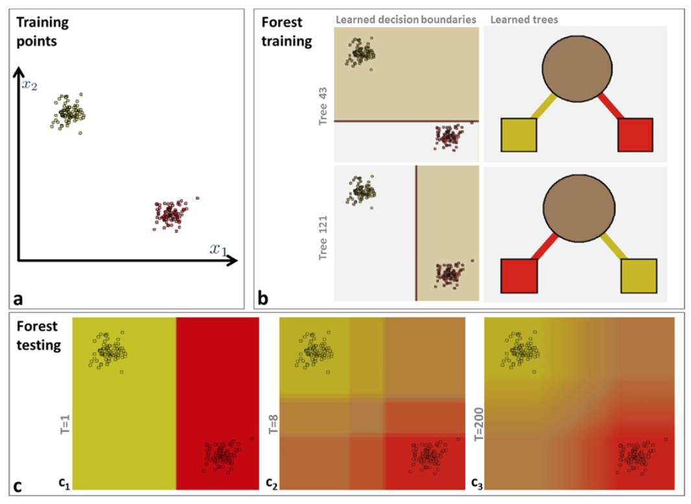
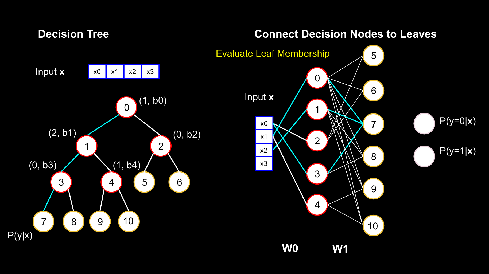

```{r setup, echo=FALSE, message=FALSE, results='hide'}
knitr::opts_chunk$set(echo=FALSE, warning=FALSE, message=FALSE, fig.width=10,
                      cache=TRUE)
if (!require("pacman")) install.packages("pacman")
pacman::p_load(dplyr, ggplot2, data.table, pander, rpart, rattle, rpart.plot, 
               RColorBrewer, party, partykit, caret, scales, randomForest, pROC,
               nnet)
# Colourblind friendly palettes from:
#       http://www.cookbook-r.com/Graphs/Colors_(ggplot2)/
cbbPalette <- c("#000000", "#E69F00", "#56B4E9", "#009E73", "#F0E442", 
                "#0072B2", "#D55E00", "#CC79A7") 
cbPalette <- c("#999999", "#E69F00", "#56B4E9", "#009E73", "#F0E442", 
               "#0072B2", "#D55E00", "#CC79A7")

```


## Leo Breiman (1928-2005) {.columns-2}


  
</br></br></br></br></br></br></br></br>
"Come on now! How could you be me and want to be someone else?"  
<!-- Kanye West, in the Guardian August 2005 --> 


# Why Random Forests
> * And why should I bother listening...


## Flexible and simple to implement
* Takes any data type as-is: no data transformations required
* R and Python off-the-shelf implementations are good
* Can be used to fill in missing values
* Model validation is inbuilt


## Easy to understand and interpret {.columns-2}
</br></br></br></br>  

* Variable importance is a by product of the model
* Trees reveal the model's thought process

</br></br></br></br></br>   

//  

  


## Fast & Accurate {.build}
> - Easily parallelisable
> - Wins Kaggle competitions
> - Used by big companies e.g. Microsoft in the Kinect
> - Active research c.f. Decision Forrests (Criminisi and Shotton)
> - They are the single greatest living model

Jokes aside, when 179 classifiers were trained on all 121 datasets in the UCI 
Machine Learning repository, Random Forests swept the floor:

- the **highest average accuracy**
- in the top 10% of classifiers for 84% of the datasets

(Source: Fernandez-Delgado et al 2014 - Journal of Machine Learning Research)

---

  
<!-- "Success is the best revenge" --> 

---

```{r UCB-plot, fig.width=10, fig.cap="The 121 datasets ordered by Random Forest accuracy and compared with Logistic Regression (multiclass), MLP (one hidden layer), and SVM (gaussian kernel)"}
res <- data.table(read.table('data/Delgado_results.txt', sep="", nrows=121, 
                  na.strings='--', header=T))
# res <- read.table('data/Delgado_results.txt.orig', sep="",  
#                   na.strings='--', header=T)
# res <- fread("http://persoal.citius.usc.es/manuel.fernandez.delgado/papers/jmlr/results.txt")
res.sub <- res[,list(problema, parRF_caret, Logistic_weka, mlp_matlab, svm_C, max, mean)]
# res.sub[order(-rank(mean))]
res.sub[, Dataset := rank(res.sub$parRF_caret, ties='first')]
cols <- c("parRF_caret", "Logistic_weka", "mlp_matlab", "svm_C", "max")
res.sub[ , (cols) := lapply(.SD, function(x){out <- x; out[is.na(out)] <- 0; out}), .SDcols = cols]
res.melt <- 
    melt(res.sub[,list(problema, Dataset, parRF_caret, Logistic_weka, mlp_matlab, svm_C, max)], 
         c("problema","Dataset"), variable.name='Model', value.name = 'Accuracy') 
ggplot(res.melt, aes(x=Dataset, y=Accuracy, colour=Model)) +
    geom_point(aes(shape=Model)) +
    scale_colour_manual(values=cbbPalette) + 
    theme(axis.text.x=element_blank())
```

---

```{r UCB-plot3, fig.cap="Selected datasets where Random Forest performs poorly against Logistic Regression (any where it is at least 5 percentage points worse)"}
res.melt2 <- 
    melt(res.sub[Logistic_weka != 0 & parRF_caret-Logistic_weka < -5, list(problema, Dataset, parRF_caret, Logistic_weka, mlp_matlab, svm_C, max)], 
         c("problema","Dataset"), variable.name='Model', value.name = 'Accuracy') 
ggplot(res.melt2, aes(x=problema, y=Accuracy, colour=Model)) +
    geom_point(aes(shape=Model)) +
    scale_colour_manual(values=cbbPalette)
```

---

```{r UCB-plot2, fig.width=10, fig.cap="Selected datasets where Random Forest performs well against Logistic Regression (any where it is at least 25 percentage points better)"}
res.melt2 <- 
    melt(res.sub[Logistic_weka != 0 & parRF_caret-Logistic_weka > 25,list(problema, Dataset, parRF_caret, Logistic_weka, mlp_matlab, svm_C, max)], 
         c("problema","Dataset"), variable.name='Model', value.name = 'Accuracy') 
ggplot(res.melt2, aes(x=problema, y=Accuracy, colour=Model)) +
    geom_point(aes(shape=Model)) +
    scale_colour_manual(values=cbbPalette)
```

---

```{r dataset-desc, }
UCI.tables <- data.table(read.csv('./data/UCI_stats.csv'))
pander::pander(UCI.tables[RF_vs_LR < 0,], 
               split.cell = 80, 
               split.table = Inf,
               digits = 2, 
               caption = "Selected datasets where RF performs poorly", 
               justify = 'left')
```

---

```{r dataset-desc2, }
pander::pander(UCI.tables[RF_vs_LR > 0,], 
               split.cell = 80, 
               split.table = Inf,
               digits = 2, 
               caption = "Selected datasets where RF performs well", 
               justify = 'left')
```


# Decision Trees

## What are they {.columns-2}

</br></br></br></br>

* A succession of binary decisions
* Predictions are made at each leaf

> - Basically the design of an annoying facebook quiz
> - *"Which Lord of the Rings character are you?!"*

</br></br></br></br></br></br>

  

## Why use them
* Out-of-the-box magic
    * Takes a mix of categorical and continuous unscaled data
* Interpretable results
* Quick to train


## Learning the splits {.columns-2 .build .smaller}
Learning method for the CART algorithm (binary trees)

* Categorical features with $C$ categories: $2^{C-1} - 1$ possible splits
* Continuous or ordinals features with K values: $K - 1$ possible splits

Algorithm:

* Evaluate the "splitting criterion" at all possible splits
* Pick the best one
* Repeat until "splitting criterion" gets worse, or child is pure

Consequence: will never think outside the box

 


## Toy Example - Predicting Bedtime

```{r interactions}
sleep.cont <- data.table(
    data.frame(
        hour = rep(0:23,2),
        bed_b4_midnight = factor(rep(0:1, 1, each=24)),
        presentation_rating = 
            c(cospi(0:23/10) * 5 + 5, sinpi(0:23/10 - .5) * 5 + 5)
    )
)
sleep <- copy(sleep.cont)
sleep[, presentation_rating:=cut(presentation_rating,3,labels=c("poor", "average","good"))]
# ggplot(sleep, aes(x=hour, y=bed_b4_midnight, col=presentation_rating)) + 
#     geom_point(aes(shape=presentation_rating)) +
#     scale_colour_manual(values=cbbPalette)
ggplot(sleep, aes(x=hour, y=presentation_rating, col=bed_b4_midnight)) + 
    geom_point(aes(shape=bed_b4_midnight), size=5, alpha=.5) +
    scale_colour_manual(values=cbbPalette) + 
    xlab('Hour of presentation') + 
    ylab('Presentation rating')
```

## Logistic Regression Fit

```{r glm1-fit}
glm1 <- glm(bed_b4_midnight ~ hour + presentation_rating, 
            family= binomial(link='logit'), data=sleep)

test <- expand.grid(presentation_rating=c("poor", "average","good"), hour=0:23)
glm1.pred <- predict(glm1, newdata = test, type='response')
glm1.class.pred <- cut(glm1.pred,2,labels=c(0, 1))

test.res <- cbind(test, bed_b4_midnight=glm1.class.pred, predicted.prob=glm1.pred)

trn.res <- merge(test.res, sleep[,list(hour,presentation_rating)])
                 
trn.class.pred <- with(trn.res, trn.res[order(hour, presentation_rating),])$bed_b4_midnight
acc <- sum(trn.class.pred==sleep[order(hour, presentation_rating), bed_b4_midnight]) / nrow(sleep)

ggplot(test.res, aes(x=hour, y=presentation_rating)) + 
    geom_point(aes(fill=predicted.prob), shape=as.numeric(as.character(test.res$bed_b4_midnight))*3 + 21, size = 5) +
    geom_point(data=sleep[bed_b4_midnight=='0',], aes(x=hour, y=presentation_rating), col=cbbPalette[1], shape=1, size=10, fill=NA) +
    geom_point(data=sleep[bed_b4_midnight=='1',], aes(x=hour, y=presentation_rating), col=cbbPalette[2], shape=2, size=10, fill=NA) +
    scale_colour_manual(values=cbbPalette) + 
    scale_fill_gradient2(limits=c(0, 1), low = cbbPalette[1], mid = "white",
                         high = cbbPalette[2], midpoint = 0.5, space = "Lab") + 
    xlab('Hour of presentation') + 
    ylab('Presentation rating') +
    ggtitle(sprintf('Accuracy: %0.3f', acc))
```

## Decision Tree Fit

```{r rpart1-fit}
rpart1 <- rpart(bed_b4_midnight ~ hour + presentation_rating, sleep)			# A more reasonable tree

rpart1.pred <- predict(rpart1, newdata = test, type='prob')[,2]
rpart1.class.pred <- predict(rpart1, newdata = test, type='class')

test.res <- cbind(test, bed_b4_midnight=rpart1.class.pred, predicted.prob=rpart1.pred)

trn.res <- merge(test.res, sleep[,list(hour,presentation_rating)])
                 
trn.class.pred <- with(trn.res, trn.res[order(hour, presentation_rating),])$bed_b4_midnight
acc <- sum(trn.class.pred==sleep[order(hour, presentation_rating), bed_b4_midnight]) / nrow(sleep)

ggplot(test.res, aes(x=hour, y=presentation_rating)) + 
    geom_point(aes(fill=predicted.prob), shape=as.numeric(as.character(test.res$bed_b4_midnight))*3 + 21, size = 5) +
    geom_point(data=sleep[bed_b4_midnight=='0',], aes(x=hour, y=presentation_rating), col=cbbPalette[1], shape=1, size=10, fill=NA) +
    geom_point(data=sleep[bed_b4_midnight=='1',], aes(x=hour, y=presentation_rating), col=cbbPalette[2], shape=2, size=10, fill=NA) +
    scale_colour_manual(values=cbbPalette) + 
    scale_fill_gradient2(limits=c(0, 1), low = cbbPalette[1], mid = "white",
                         high = cbbPalette[2], midpoint = 0.5, space = "Lab") + 
    xlab('Hour of presentation') + 
    ylab('Presentation rating') +
    ggtitle(sprintf('Accuracy: %0.3f', acc))
```

<!-- ## Logistic Regression (with interaction terms) Fit -->

```{r glm2-fit, eval=FALSE}
glm2 <- glm(bed_b4_midnight ~ hour + presentation_rating + hour:presentation_rating, 
            family= binomial(link='logit'), data=sleep)

test <- expand.grid(presentation_rating=c("poor", "average","good"), hour=0:23)
glm2.pred <- predict(glm2, newdata = test, type='response')
glm2.class.pred <- cut(glm2.pred,2,labels=c(0, 1))

test.res <- cbind(test, bed_b4_midnight=glm2.class.pred, predicted.prob=glm2.pred)

trn.res <- merge(test.res, sleep[,list(hour,presentation_rating)])
                 
trn.class.pred <- with(trn.res, trn.res[order(hour, presentation_rating),])$bed_b4_midnight
acc <- sum(trn.class.pred==sleep[order(hour, presentation_rating), bed_b4_midnight]) / nrow(sleep)

ggplot(test.res, aes(x=hour, y=presentation_rating)) + 
    geom_point(aes(fill=predicted.prob), shape=as.numeric(as.character(test.res$bed_b4_midnight))*3 + 21, size = 5) +
    geom_point(data=sleep[bed_b4_midnight=='0',], aes(x=hour, y=presentation_rating), col=cbbPalette[1], shape=1, size=10, fill=NA) +
    geom_point(data=sleep[bed_b4_midnight=='1',], aes(x=hour, y=presentation_rating), col=cbbPalette[2], shape=2, size=10, fill=NA) +
    scale_colour_manual(values=cbbPalette) + 
    scale_fill_gradient2(limits=c(0, 1), low = cbbPalette[1], mid = "white",
                         high = cbbPalette[2], midpoint = 0.5, space = "Lab") + 
    xlab('Hour of presentation') + 
    ylab('Presentation rating') +
    ggtitle(sprintf('Accuracy: %0.3f', acc))
```


## The learned decision tree

```{r plot-tree}
fancyRpartPlot(rpart1, palettes=c("Greys", "Oranges"))				# A fancy plot from rattle
```


## Main advantage of Decision Trees
* Can model interactions
* No need to generate more features in your data


### Main issues with Decision Trees
* Baised
* Splits space into boxes


## Random Forrest Fit

```{r rf1-fit}
rf1 <- randomForest(bed_b4_midnight ~ hour + presentation_rating, sleep)			# A more reasonable tree

rf1.pred <- predict(rf1, newdata = test, type='prob')[,2]
rf1.class.pred <- predict(rf1, newdata = test, type='response')

test.res <- cbind(test, bed_b4_midnight=rf1.class.pred, predicted.prob=rf1.pred)

trn.res <- merge(test.res, sleep[,list(hour,presentation_rating)])
                 
trn.class.pred <- with(trn.res, trn.res[order(hour, presentation_rating),])$bed_b4_midnight
acc <- sum(trn.class.pred==sleep[order(hour, presentation_rating), bed_b4_midnight]) / nrow(sleep)

ggplot(test.res, aes(x=hour, y=presentation_rating)) + 
    geom_point(aes(fill=predicted.prob), shape=as.numeric(as.character(test.res$bed_b4_midnight))*3 + 21, size = 5) +
    geom_point(data=sleep[bed_b4_midnight=='0',], aes(x=hour, y=presentation_rating), col=cbbPalette[1], shape=1, size=10, fill=NA) +
    geom_point(data=sleep[bed_b4_midnight=='1',], aes(x=hour, y=presentation_rating), col=cbbPalette[2], shape=2, size=10, fill=NA) +
    scale_colour_manual(values=cbbPalette) + 
    scale_fill_gradient2(limits=c(0, 1), low = cbbPalette[1], mid = "white",
                         high = cbbPalette[2], midpoint = 0.5, space = "Lab") + 
    xlab('Hour of presentation') + 
    ylab('Presentation rating') +
    ggtitle(sprintf('Accuracy: %0.3f', acc))
```


# Random Forests


## Forests - Averaging many trees

  

From Criminisi & Shotton 2013 Decision Forests for Computer Vision and Medical Image Analysis


## Reducing the variance
* Bias variance tradeoff in action

### Randomise splitting
* Choose a subset of features to consider
* Choose the feature in the subset with the best splitting critereon

### Randomise training data
* Draw a different bootstrap sample for each tree

* Each tree is more biased than the original
* Ensemble of weak learners is better than 1 strong

## Tuning parameters

* Complexity of trees (depth etc.)
* Number of features considered at each split
* ~~Random Forrests dont overfit~~ number of trees not a tuning parameter

## Feature importance

* Average out the improvement in the splitting critereon
* Can even work per output class
* Doing this for regression involves permutation

## Example: Flags data
```{r flags}
col.names <- c('name',
               'landmass',
               'zone',
               'area',
               'population',
               'language',
               'religion',
               'bars',
               'stripes',
               'colours',
               'red',
               'green',
               'blue',
               'gold',
               'white',
               'black',
               'orange',
               'mainhue',
               'circles',
               'crosses',
               'saltires',
               'quarters',
               'sunstars',
               'crescent',
               'triangle',
               'icon',
               'animate',
               'text',
               'topleft',
               'botright')
flags <- read.csv(
    'https://archive.ics.uci.edu/ml/machine-learning-databases/flags/flag.data',
    header = FALSE,
    colClasses = 'factor',
    col.names = col.names)
flags$area <- as.numeric(as.character(flags$area))
flags$population <- as.numeric(as.character(flags$population))
flags$sunstars <- as.numeric(as.character(flags$sunstars))
flags$quarters <- as.numeric(as.character(flags$quarters))
flags$bars <- as.numeric(as.character(flags$bars))
flags$stripes <- as.numeric(as.character(flags$stripes))
flags$circles <- as.numeric(as.character(flags$circles))
flags$crosses <- as.numeric(as.character(flags$circles))
flags$colours <- as.numeric(as.character(flags$colours))
flags <- flags[,-1]
```

```{r, eval=FALSE}
table(flags$religion)
str(flags)
```

* 28 features: country statistics and flag information
* Outcome: religion - 8 classes

--- 

```{r, cache=TRUE, fig.cap="Feature importance for an out-of-the-box Random Forest trained on `Flags`"}
n <- nrow(flags)
set.seed(19235)
trn <- sample(1:n, 0.7*n)
rf.flags <- randomForest(religion ~ ., data=flags, importance=TRUE, subset=trn)
# lr.flags <- multinom(religion ~ ., data=flags, subset = trn)
tmp <- importance(rf.flags)
rf.imp <- data.table(tmp)
f <- rownames(tmp)
levels <- row.names(tmp)[order(-rf.imp$MeanDecreaseGini)]
rf.imp[, feature:=factor(f,levels=levels)]
rf.imp.melt <- melt(rf.imp[,list(feature, MeanDecreaseGini, MeanDecreaseAccuracy)],
                    id.vars = 'feature', variable.name = 'importance')
ggplot(rf.imp.melt, aes(x = feature, y = value, fill = importance)) +
    geom_bar(stat='identity', position='dodge') +
    theme(axis.text.x = element_text(angle = 45, hjust = 1)) +
    scale_fill_manual(values=cbbPalette)
```

---

```{r flags-part}
# 1=N.America, 2=S.America, 3=Europe, 4=Africa, 4=Asia, 6=Oceania
rpart.flags <- rpart(religion ~ ., data=flags, subset=trn)
fancyRpartPlot(rpart.flags)
```

---

```{r flags-part2}
# 1=N.America, 2=S.America, 3=Europe, 4=Africa, 4=Asia, 6=Oceania
trn2 <- sample(1:n, 0.7*n)
rpart.flags <- rpart(religion ~ ., data=flags, subset=trn2)
fancyRpartPlot(rpart.flags)
```

---

```{r flags-part3}
# 1=N.America, 2=S.America, 3=Europe, 4=Africa, 4=Asia, 6=Oceania
trn3 <- sample(1:n, 0.7*n)
rpart.flags <- rpart(religion ~ ., data=flags, subset=trn3, control = rpart.control(minsplit = 10))
fancyRpartPlot(rpart.flags)
```


## Tricks

* Non axis aligned splits e.g. kernalised decision forests
* Dealing with class imbalance with stratified sampling
* Missing value imputation by recursion initialising at the mean value
* Initialisation for a neural network (Welbl 2014) (Kontschieder 2015 @ ICCV)
* Feature factories - parametrise features


## RF to NN

Oisin Mac Aodha - slide from presentation in 2015
 


## Thank you for listening {.build}

  

