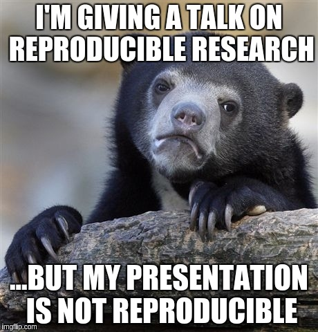
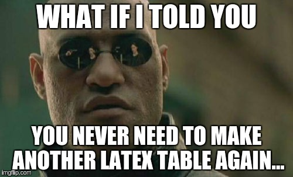
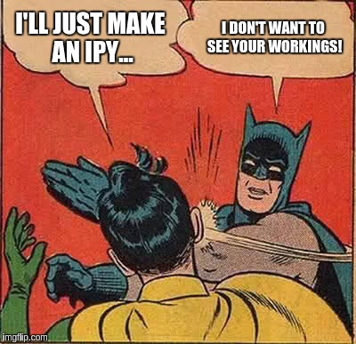
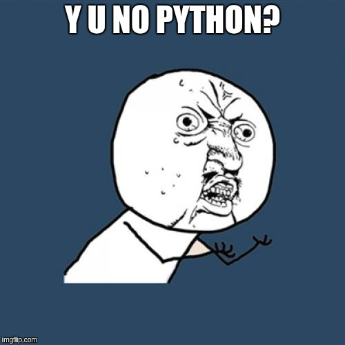
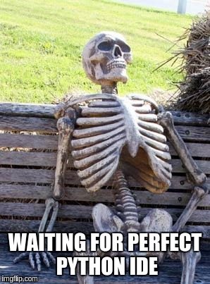
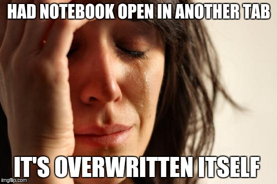

```{r setup, echo=FALSE, message=FALSE, results='hide'}
knitr::opts_chunk$set(echo=FALSE, warning=FALSE, message=FALSE, fig.width=10,
                      cache=TRUE)
if (!require("pacman")) install.packages("pacman", repos='http://star-www.st-andrews.ac.uk/cran/')
pacman::p_load(dplyr, ggplot2, data.table, pander, rpart, rattle, rpart.plot, 
               RColorBrewer, party, partykit, caret, scales, randomForest, pROC,
               nnet)
# Colourblind friendly palettes from:
#       http://www.cookbook-r.com/Graphs/Colors_(ggplot2)/
cbbPalette <- c("#000000", "#E69F00", "#56B4E9", "#009E73", "#F0E442", 
                "#0072B2", "#D55E00", "#CC79A7") 
cbPalette <- c("#999999", "#E69F00", "#56B4E9", "#009E73", "#F0E442", 
               "#0072B2", "#D55E00", "#CC79A7")

```

## Purpose

To convince you it is worth the time investment to make
your research more reproducible


## Motivation {.columns-2}


  
</br></br></br></br></br></br>
"*Your closest collaborator is you six months ago, but you don't reply to emails.*"
</br></br>**Karl Broman**, University of Wisconsin–Madison
<!-- Kanye West, in the Guardian August 2005 --> 

<!--
## Attribution
Some of this talk is adapted from [slides by Karl](http://kbroman.org/Tools4RR/pages/schedule.html)
-->

## A real issue? {.larger}

* [Nature study](http://www.nature.com/news/first-results-from-psychology-s-largest-reproducibility-test-1.17433) in 2015 trying to reproduce Psychology results managed just **39 out of 100**
* [LaCour scandal](http://fivethirtyeight.com/datalab/as-a-major-retraction-shows-were-all-vulnerable-to-faked-data/) In 2015 saw him fabricate survey data
* ...how many hours have you wasted correcting tables/figures

## An example research project... {.columns-2}


Whiteboard time!


## A solution?



## Basic concepts
* One file generates the report
* Full automation - the code describes your entire process i.e.
    - **NO** copy & pasting results into the report
    - **NO** hand editing data
* If the data/code changes the report doesn't need to
    - You can even automate in line data within the report


## Generating reports from markdown
More whiteboard time!


## Solutions  {.columns-2 .build }

Ipython Notebooks?


RStudio + RMarkdown?



## A brief introduction to the main contenders {.build .smaller}

> * Ipython notebook
    * %qtconsole or %connect_info 
    * console + editor + plot viewer?
    * with `nbconvert` generator
    * server based
> * RStudio
    * console
    * editor
    * plot viewer
    * report generator
    * RStudio server is not free


## Some other contenders {.build .smaller}

> * MATLAB
    * Like RStudio but with really bad report generation
    * ...**really** really bad report generation
    * ...**expensive** really really bad report generation
> * Pycharm
    * Comprehensive python IDE
    * No plot viewer though
    * ...but can open ipython notebooks

## Some other other contenders {.build .smaller}

> * Rodeo
    * Much more like RStudio with plot viewer
    * No decent report generation
    * ...yet (I'm on their Slack channel - it's coming soon!)
    * But is server based so you can access like ipython notebooks
> * Spyder
    * Just another python IDE
> * Pweave
    * python package for doing report generation

## ...




## Three stages of research {.smaller}

* Exploration
    - Investigate the data
    - Try out new code packages
    - Communicate with colleagues
* Experimentation
    - Generate the results
    - Perhaps very long runtimes
* Reporting
    - Produce a polished document
    - Documents what you did, how you did it, and the results
    - For people interested in results alone
    - ...but also for people to reproduce and extend


# Ipython vs. Markdown: Exploration

## Sharing pilot work with team
* Ipython ideal - allows for sharing of expected results and ability to interact
    * like sharing a console session
* Rmd is essentially sharing a script
* Same with Rodeo and MATLAB

## Pair programming
* Ipython and Rmd crap
* Rodeo however has support


# Ipython vs. Markdown: Experimentation

* Ipython can sit on a beefy server and be accessed from anywhere
* RStudio can't: RStudio Server is not free
* Rodeo + Pweave could be a Markdown solution...

## Markdown's trick...


# Ipython vs. Markdown: Reporting

## Interactive apps
* Shiney
* Ipython Widgets

## Reporting {.smaller}
```{r}
# hack to print r code inline
rinline <- function(code) {
  sprintf('``` `r %s` ```', code)
}
```
e.g. presentations, blogging, sharing partial results with people not interested in details, writing a paper

* With markdown you write the document from the start
* Very stable - new process spawned for each run (no chance of stray globals)
* Very flexible:
    * hide code chunks
    * hide code output
    * caching
    * inline code (e.g. "The maximum cat size was `r rinline('max(myData$catsz)')`")
* Ipython notebook is getting there; python notebook extensions include:
    * hiding code chunks
    * inline code
* ...but no safeguards (have to restart kernel and run all yourself)
* ...no caching (can pickle)
* ...hiding cells is a pain and not explicit

## ...Documenting packages

* IPython excels here - learn by doing
* Markdown generates static documents

# Ipython vs. R Markdown: General


## Univerersal language support

## Stability: interrogating your variables



## Resources

Karl Broman's course on Reproducible Research http://kbroman.org/Tools4RR/pages/schedule.html